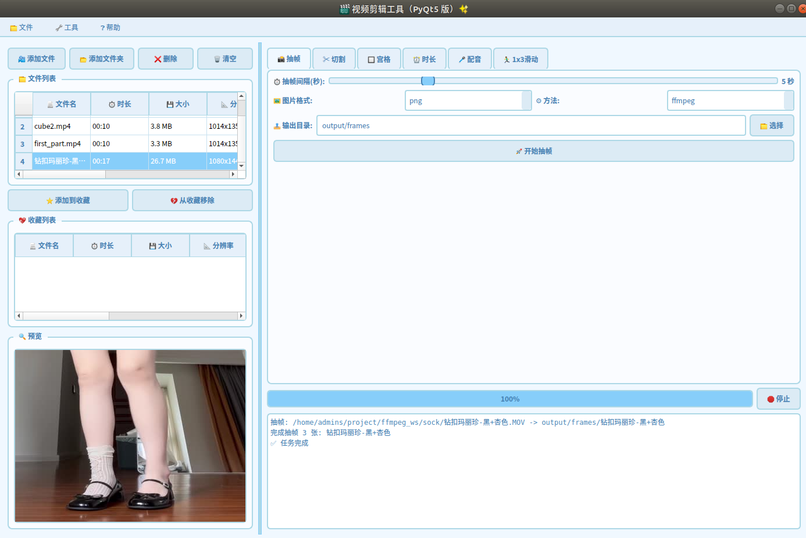

# ffmpeg_ws

## 视频剪辑 GUI（Video Clips）

基于 PyQt5 的本地图形界面视频工具，无需 OpenCV/Tkinter，集成以下能力：
- 抽帧封面（FFmpeg/MoviePy 两种方式）
- 时间间隔剪辑/随机切割（无重编码高效分段）
- 宫格拼接（2×1、2×2、3×1、2×3 等）
- 指定时长拼接（10s/15s/20s 等）
- 音乐配对与淡入淡出
- 滑动条拼接（1×3 等样式）

界面预览：



快速开始：
1) 安装依赖与 FFmpeg（系统需已安装 ffmpeg 并在 PATH 中）
	- Python 依赖：项目根目录执行 `pip install -r requirements.txt`
	- FFmpeg 检查：`ffmpeg -version`
2) 启动 GUI
	- 从项目根目录运行：`python video_clips/main_qt5.py`
	- 无显示环境（如服务器）若出现 Qt 插件报错，可设置 `QT_QPA_PLATFORM=offscreen` 后再运行。

更多功能与使用说明请查看：`video_clips/README.md`

## 语音转文字（STT）入口

详细的 Whisper/Vosk 使用说明、离线方案与示例命令，已迁移至：
- `stt/README.md`

快速入口（从仓库根目录运行）：
- Whisper（CPU/int8）：`conda run --name ffmpeg_ws-py38 python stt/stt_whisper.py -i stt/input/1.mp3 -m tiny --device cpu --compute-type int8 --task transcribe --zh-simplified --print`
- Vosk（离线）：`conda run --name ffmpeg_ws-py38 python stt/stt_vosk.py -i stt/input/1.mp3 -m stt/vosk-model-small-cn-0.22 -o stt/output/1.vosk.txt`

#### 视频自动化剪辑开发项

- [x] 视频抽帧封面
- [x] 时间间隔剪辑
- [x] 随机组合视频素材4/9宫格拼图视频
- [x] 随机组合音频素材功能
- [x] 合成视频高清适配
- [ ] 字幕讲解开发
- [x] 视频调色功能(Luts预设来实现)
- [ ] 特效转场开发
- [ ] log标注


## 常用 ffmpeg 片段（示例）

音视频常用命令：
```bash
# 视频提取音频
ffmpeg -i 20240603_165541.mp4 -vn -acodec libmp3lame -ab 128k output_audio.mp3
# 封面抽帧
ffmpeg -i jia.mp4 -r 1 image-%3d.jpeg
# 视频按 10s 切段
ffmpeg -i output.mp4 -f segment -segment_time 10 -c copy -reset_timestamps 1 output%03d.mp4
```

## 问题汇总

1) Unknown encoder 'libx264'（缺少 x264）
```makefile
git clone https://git.ffmpeg.org/ffmpeg.git ffmpeg
cd ffmpeg
./configure --enable-gpl --enable-libx264
make
sudo make install
```

2) 安装 moviepy 不生效
```bash
conda install -c conda-forge moviepy
```

## 资源
- STT 参考站点：https://www.csubtitle.com/

## 小红书图片/视频下载

- 脚本：`toolkits/xhs_downloader.py`
- 依赖：`pip install -r requirements.txt`（需 Chrome/Chromium；m3u8 合并需要 ffmpeg）

示例：
```bash
# 单条笔记
python toolkits/xhs_downloader.py --note "https://www.xiaohongshu.com/explore/xxxxx" -o ./xhs_downloads

# 用户主页前 N 条
python toolkits/xhs_downloader.py --profile "https://www.xiaohongshu.com/user/profile/xxxxxxxx" -n 20 -o ./xhs_downloads
```